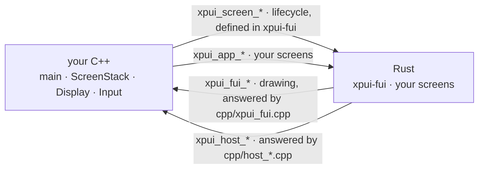
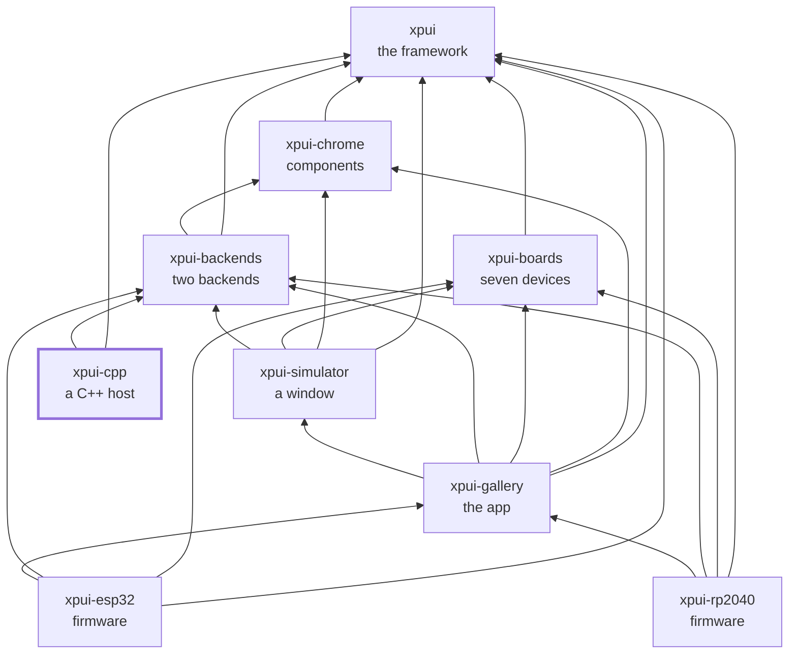

# `xpui-cpp`

> ⚠️ **Under heavy development.** Not production-ready. The API can break
> without notice. Use at your own risk.

The C++ side of the boundary: an application that already owns its screen
stack, hosting `xpui` screens over a C ABI.

This is the repository to read if you have a firmware written in C++ and want
one screen of it in Rust. Not a rewrite — a screen at a time, called through
six lifecycle entry points and an opaque `void*`.

## Which directory you want

| | |
|---|---|
| [`docs/tutorial.md`](docs/tutorial.md) | **Start here.** Eleven steps: write a screen, get its words from your string table, export it, drive it, open it from the menu you already have, answer what the framework asks, teach the firmware a new symbol, start it, build it, test it with no device, and flash it |
| [`cpp_host`](cpp_host/) | The worked example, and the only thing any gate in this organisation builds, links and *runs* the FreeInkUI shim through. Design an ABI change here |
| [`firmware`](firmware/) | The same C++ through PlatformIO, for a real ESP32. No gate invokes it, so a break surfaces when somebody builds a firmware |
| [`abi`](abi/) | Two of the five ABI boundaries, checked — the two that cross into the *application*: `xpui_host.h` against the Rust that calls it, and `xpui_app.h` against the macro that defines it. The other three are the backend's and are checked there |

## The boundary runs both ways

Four sets of symbols, two crossing each way, and every one declared in exactly
one header:

Two arrows each way. The two pointing right are things Rust gives you; the two
pointing left are what **you** implement in C++.



The handle is double-boxed — `Box<Box<dyn Driver>>` — because `dyn Driver` is a
fat pointer and cannot cross as one word. Unwrap it once too few and it is a
wild pointer, not a type error.

## What it depends on

[`xpui`](https://github.com/XPUI-Framework/xpui-framework) and the FreeInkUI
backend from
[`xpui-backends`](https://github.com/XPUI-Framework/xpui-backends), whose
`fui/cpp/` this compiles and links. That one is a **sibling checkout**, not a
package path: nothing is published, and a git dependency lands in a cargo
checkout directory with no path a `CMakeLists.txt` can name. Clone it beside
this repository, or set `XPUI_BACKENDS_DIR`.

The FreeInk SDK is the same arrangement — beside the checkout, or named by
`FREEINK_SDK_INCLUDE`, or fetched by CMake at the revision
[`cpp_host/freeink-sdk.rev`](cpp_host/freeink-sdk.rev) pins.

Nothing depends on this repository. It is the far end.

## Checking it

```bash
./build-and-test.sh          # format, lint, test, and every snippet
./build-and-test.sh all      # plus cmake, the link, and nine ctest cases
```

The checks themselves are in [`xtask/`](xtask/) — this repository's own list,
in Rust, holding nothing it does not run. `./build-and-test.sh fix` formats
in place first.

`all` builds the host with CMake, links the Rust archive into it and runs nine
`ctest` cases — the only place in the organisation where the C ABI is compiled,
linked and *executed* rather than syntax-checked.

## Where it sits

Every arrow is a dependency in a `Cargo.toml`, and they all point inward
toward `xpui`, which depends on nothing at all. That is the rule the
organisation is arranged around: a backend can be written without the framework
knowing it exists, and a firmware reaches whatever it needs directly rather
than through whoever happens to sit above it.



## License

MIT — see [LICENSE](LICENSE). Copyright (c) 2026 Thiago Holanda.
