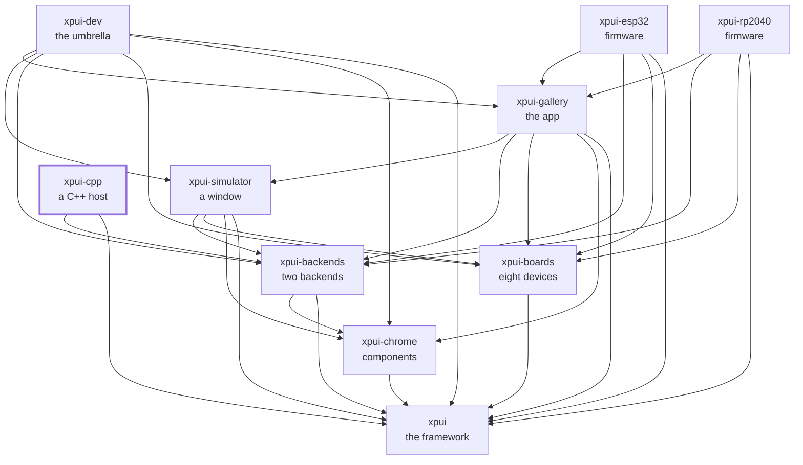

[](https://github.com/XPUI-Framework/xpui-cpp/actions/workflows/ci.yml) [](LICENSE)

<picture>
  <source media="(prefers-color-scheme: dark)" srcset="assets/logo-black.png">
  
</picture>

# C++

> [!WARNING]
> Under heavy development. Not production-ready. The API can break without
> notice. Use at your own risk.

The C++ side of the boundary: an application that already owns its screen
stack, hosting `xpui` screens over a C ABI. This is the repository to read if
you have a firmware written in C++ and want one screen of it in [Rust](https://rust-lang.org/). Not a
rewrite — a screen at a time, called through six lifecycle entry points and an
opaque `void*`.

Every document in this repository is listed in [docs/README.md](docs/README.md).

## Which crate you want

|                         |                                                                                                                                                                                                                                                                          |
| ----------------------- | ------------------------------------------------------------------------------------------------------------------------------------------------------------------------------------------------------------------------------------------------------------------------ |
| [`cpp_host`](cpp_host/) | The worked example, and the only thing any gate in this organisation builds, links and _runs_ the [FreeInkUI](https://github.com/Free-Ink/freeink-sdk/tree/main/libs/ui/FreeInkUI) shim through. Design an ABI change here                                                                                                                      |
| [`firmware`](firmware/) | The same C++ through [PlatformIO](https://platformio.org/), for a real ESP32. No gate invokes it, so a break surfaces when somebody builds a firmware                                                                                                                                               |
| [`abi`](abi/)           | Two of the five ABI boundaries, checked — the two that cross into the _application_: `xpui_host.h` against the Rust that calls it, and `xpui_app.h` against `src/lib.rs` and the macro that defines its factory. The other three are the backend's and are checked there |

## Using it

Nothing depends on this repository; it is the far end. Using it is following
the tutorial with a firmware of your own, or building the worked example:

```bash
cmake -S cpp_host -B target/cpp_host -G Ninja -DCMAKE_BUILD_TYPE=Release
cmake --build target/cpp_host
./target/cpp_host/xpui-host --headless --frames 30 --selftest
```

What it builds on is [`xpui`](https://github.com/XPUI-Framework/xpui-framework)
and the FreeInkUI backend from
[`xpui-backends`](https://github.com/XPUI-Framework/xpui-backends), whose
`fui/cpp/` this compiles and links. That one is a **sibling checkout**, not a
package path: nothing is published, and a git dependency lands in a cargo
checkout directory with no path a `CMakeLists.txt` can name.

## Requirements

- **`xpui-backends`, cloned beside this repository** — or named by
  `XPUI_BACKENDS_DIR`. Without it the two stages that compile C++ print
  `skipped:` and pass on a laptop, fail on CI, and `all` fails.
- **The [FreeInk SDK](https://github.com/Free-Ink/freeink-sdk)'s FreeInkUI headers**, for those same two stages: named
  by `FREEINK_SDK_INCLUDE`, or in one of the sibling layouts `freeink_include`
  in [`xtask/src/cpp.rs`](xtask/src/cpp.rs) lists. Without them both skip
  and pass, except on CI, where a skip is a failure. `all` needs no local copy: [CMake](https://cmake.org/) fetches the revision
  [`cpp_host/freeink-sdk.rev`](cpp_host/freeink-sdk.rev) pins, which CI
  reads too.
- **[SDL2](https://www.libsdl.org/)**, for the desktop host's window.
- **[clang-format](https://clang.llvm.org/docs/ClangFormat.html) 21 or newer**, for the C++ format stage; an older binary
  ignores options it does not know and formats differently, silently.
- **CMake and [Ninja](https://ninja-build.org/)**, for `all`.

## Checking it

```bash
./build-and-test.sh          # format, lint, test, and every snippet
./build-and-test.sh all      # plus cmake, the link, and nine ctest cases
```

The checks themselves are in [`xtask/`](xtask/) — this repository's own list,
in Rust, holding nothing it does not run. `./build-and-test.sh fix` formats
in place first. `all` is the only place in the organisation where the C ABI
is compiled, linked and _executed_ rather than syntax-checked. How a change is
reviewed is in [docs/contributing.md](docs/contributing.md).

## Where it sits

Every arrow is a dependency in a `Cargo.toml`, and they all point inward
toward `xpui`, which depends on nothing at all. That is the rule the
organisation is arranged around: a backend can be written without the framework
knowing it exists, and a firmware reaches whatever it needs directly rather
than through whoever happens to sit above it.



## License

MIT — see [LICENSE](LICENSE). Copyright (c) 2026 Thiago Holanda.
