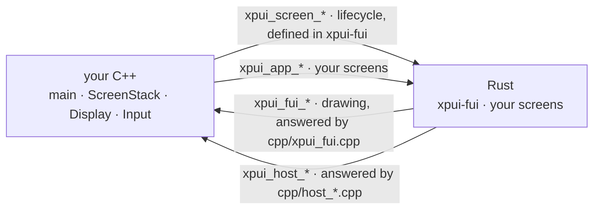

# The boundary

The C ABI between a C++ application and its Rust screens: which symbols
cross, in which direction, who defines each, what the desktop host was
modelled on, and what proves the two sides agree.

## Four sets of symbols, two crossing each way

Every one is declared in exactly one header. The two pointing right are
things Rust gives you; the two pointing left are what **you** implement in
C++.

| Header | Declares | Defined in | Called from |
|---|---|---|---|
| `xpui-backends`' `fui/cpp/xpui_fui.h` | drawing | `xpui_fui.cpp` | Rust |
| `xpui-backends`' `fui/cpp/xpui_screen.h` | the screen lifecycle | `xpui-fui`'s `lifecycle.rs` | C++ |
| [`cpp_host/cpp/xpui_host.h`](../cpp_host/cpp/xpui_host.h) | input, i18n, device, heap, navigation | `cpp/host_*.cpp` | Rust |
| [`cpp_host/cpp/xpui_app.h`](../cpp_host/cpp/xpui_app.h) | install, and the root screen's factory | `src/lib.rs` | C++ |

`symbols_agree` in [`xtask/src/boundary.rs`](../xtask/src/boundary.rs) reads
the third row's header and fails when either answer to it — the desktop
host's or the firmware's — stops carrying a name. It reads only names, and
only that header; the fourth row, and every question about *types*, is the
signature checker in [`abi/`](../abi/)'s. Two parameters swapped still links,
and still corrupts the call frame.

**The handle is double-boxed** — `Box<Box<dyn Driver>>` — because `dyn Driver`
is a fat pointer and cannot cross as one word. Unwrap it once too few and it
is a wild pointer, not a type error.

## The firmware this host was modelled on

`cpp_host` mirrors the layering of the e-reader firmware it was modelled on,
which is why this map is worth reading before moving a file. **It is a
reference, not an obligation**: the host is what the gate builds and runs,
and what an ABI change is designed and proven against. A firmware consuming
the ABI is on its own cadence, and nothing links the two.

The right-hand column is that firmware's paths, kept so the shapes can be
compared.

| Here | The firmware it was modelled on |
|---|---|
| `cpp/main.cpp` | `src/main.cpp`, and the Arduino loop |
| `cpp/ScreenHost.{h,cpp}` | `src/activities/ActivityRs.{h,cpp}` |
| `cpp/ScreenStack.{h,cpp}` | `src/activities/ActivityManager.{h,cpp}` |
| `cpp/Display.{h,cpp}` | `GfxRenderer` and the panel driver |
| `cpp/Input.{h,cpp}` | `src/MappedInputManager.cpp` |
| `cpp/internal.h` | `src/rust_ffi/internal.h` |
| `cpp/host_input.cpp` | `src/rust_ffi/input.cpp` |
| `cpp/host_screen.cpp` | `src/rust_ffi/activity.cpp` |
| `cpp/host_i18n.cpp` | `src/rust_ffi/i18n.cpp` |
| `cpp/host_device.cpp` | `src/rust_ffi/device.cpp` |
| `cpp/host_heap.cpp` | `src/rust_ffi/heap.cpp` |
| `src/raw.rs` | `lib/backend_rs/src/raw.rs` |
| `src/platform.rs` | `lib/backend_rs/src/input.rs` |
| `src/shell.rs` | the `Navigator` half of `lib/backend_rs/src/firmware.rs` |
| `src/strings.rs` | `lib/backend_rs/src/i18n.rs` |
| `src/device.rs` | `lib/backend_rs/src/device.rs` |
| `src/screens/` | `lib/crosspoint_rs/src/activities/` |
| `xpui-fui`'s `src/lifecycle.rs` | `lib/backend_rs/src/lifecycle.rs` |

CrossPoint's `renderer.rs`, `theme.rs`, `font.rs`, `icon.rs` and `cells.rs`
have no counterpart because `xpui-fui` **is** their counterpart: that
firmware wrote its own backend against its own renderer, and this host uses
the one in `xpui-backends`. Its `runtime.rs` — the global allocator and the
panic handler — has one in `cpp_host/src/runtime.rs`, gated on
`target_os = "none"`, for the reason the firmware section below gives.

## Three differences from the firmware, on purpose

Each is documented at its site so it is not "fixed" back:

- **No `renderer` argument on render.** CrossPoint's own comment says its one
  is unused; a parameter nothing reads can drift from the header unnoticed.
- **One install, not two.** That firmware installs the host from `on_enter`
  *and* `render` because two FreeRTOS tasks race for the first frame. A host
  with one thread installs once, before the first screen exists.
- **`Navigator::present` crosses the FFI.** The firmware cannot push a Rust
  screen from Rust; here it can, because the handle is opaque and thin. A host
  that declines the push has not taken ownership, and the screen is reclaimed
  rather than leaked.

## What the nine `ctest` cases prove

All headless. **Every assertion is an exit code**, through the `--expect-*`
flags, never a pattern matched against the summary line: `ctest` ignores a
test's exit status entirely once `PASS_REGULAR_EXPRESSION` is set, so a run
that printed a failure and exited 1 would still be reported as passing.

`--selftest` exits non-zero unless all three of these hold. They fail
independently, and each has been broken on purpose to check that it notices:

| | Catches |
|---|---|
| something asked for the panel to update | the present hook never fired |
| a frame was blitted | the loop never painted |
| the framebuffer holds both ink and paper | **a build that linked `xpui-fui/testing`** — every C symbol replaced by a host double, links cleanly, draws nothing |

The last one is the reason this is a self-test and not just an exit code. An
all-white panel is its only symptom anywhere.

| Test | What would otherwise go unnoticed |
|---|---|
| `selftest` | the three above |
| `the_string_table_keeps_its_contract` | an unknown key coming back as anything other than the caller's own pointer. Every screen here looks up a key that is in the table, so no rendered frame reaches that branch — and the Rust side hands its result out as a `&'static str` |
| `selftest_weak_present` | the weak-symbol override losing to the shim's own no-op — a panel that never updates, with nothing to point at |
| `navigates_into_rust` | `Navigator::present` crossing the FFI: a screen leaves Rust as an opaque handle and arrives on the C++ stack |
| `back_pops_to_the_root` | the pop half of the same thing; a stack that never pushed and one that never popped are each half right |
| `draws_an_overlay` | the scrim — the call that rots quietly, because only an overlay reaches it |
| `a_plain_screen_is_mostly_paper` | an **inverted panel**. Flip the framebuffer's polarity and every other case still passes |
| `a_focused_value_control_differs_from_an_idle_one` | a `Chrome::draw_slider` that ignores the state it is handed |
| `an_open_value_control_differs_from_a_focused_one` | the two states drawn *identically*, which an ink percentage cannot see |

The last two run the binary twice and fail unless the two frames differ,
because that is the only shape the question fits: a state you cannot see is a
refresh spent saying nothing, and an outline is too little ink to move a
percentage. They compare a **crop** of the control band rather than the whole
panel — the hint bar changes whenever the keys change meaning, so two whole
frames always differ somewhere and a full-frame comparison would pass without
ever looking at the control. They also pass `--no-pair`, since a keyboard has
arrow keys and the framework never opens an edit where the pair exists.

`draws_an_overlay` and `a_plain_screen_is_mostly_paper` are a pair on purpose.
`--expect-ink` asserts a *relationship* — a scrim is ink on one checkerboard
parity of everything behind the dialog, so the panel goes from a few percent
ink to about half — and it is bounded on both sides, because a dialog whose
body never paints leaves the scrim covering what the popup would have cleared
and pushes the figure *up*. A one-sided assertion would get greener as the
dialog disappeared.

`--weak-present` runs the same thing through the weak `xpui_fui_present`
symbol the binary overrides, instead of the `xpui_fui_set_present` hook. The
hook is what a firmware should copy — whether an override beats a weak
definition is the linker's business and the failure is silent — and the flag
exists so that path is proven here rather than assumed.

## The firmware

[`firmware/`](../firmware/) builds the same C++ through PlatformIO, for a real
ESP32, and the port is the result worth reading.

### What porting to a device cost

| | |
|---|---|
| Rust changed | **nothing** |
| C++ shared with the desktop host | `ScreenHost`, `ScreenStack`, `host_screen.cpp`, `host_i18n.cpp`, and the shim |
| C++ written for the device | `main.cpp`, and four `host_*.cpp` |

The screens, the `Platform`, the `Navigator`, every `xpui_host_*` declaration
and the whole of `xpui` come from `cpp_host` **as a dependency, not a
copy** — `scripts/build_rust.py` builds that same package. What a laptop and a
device genuinely disagree about is input, the panel, device identity, the heap
and where a panic goes, which is what `firmware/cpp/` holds — `main.cpp`,
four `host_*.cpp`, and one translation unit that gives the header-only SDK a
home.
If porting had meant forking the screens, the boundary would be in the wrong
place. It did not, and that is the claim.

### The runtime lives in `cpp_host`

There is no Rust under `firmware/`, and there cannot be a wrapper crate that
adds the allocator and the panic handler a device needs. Cargo produces every
crate-type a package declares; `xpui-cpp-host` declares `staticlib`, and a
staticlib is a *final artifact*, so building it for a bare-metal target
requires both in that package, not in a downstream one. They live in
`cpp_host/src/runtime.rs`, gated on `target_os = "none"`, and a firmware
links the same archive a desktop does.

### The heap figures become true here

On the desktop host, `xpui_host_heap_*` covers the C++ side only — Rust has
its own allocator there, and the About screen says so. On a device the Rust
allocator routes through the firmware's `malloc`, so there is one heap and the
four figures cover both languages. That is the only visibility into what Rust
costs at run time: a build-time size report measures static sections, where
it contributes almost nothing.

`largest_block` also stops being `-1`. A desktop cannot measure fragmentation;
ESP-IDF can, and on a device with no MMU the gap between "free" and "largest
block" is the figure that actually decides whether the next allocation fails.

### There is no panel driver

`flush()` in `firmware/cpp/main.cpp` counts the ink and logs it, which is
where a driver goes — the C++ side of the same seam
[`xpui-esp32`](https://github.com/XPUI-Framework/xpui-esp32) marks in Rust at
`Panel::present`. No published driver exists for these panels, and a
hand-written one cannot be verified from a repository that cannot power a
panel; the screens reach the glass through the firmware that already drives
it, which is what this whole boundary is for.

### Kept in step by hand

`scripts/build_rust.py` is adapted from CrossPoint's, and `platformio.ini`'s
environments mirror its. **A change to either repository's FFI or layering
should be made in the other**, and nothing enforces it; the map above is the
file-by-file guide.
